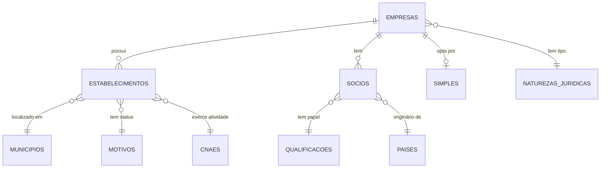

# Relacionamentos de Dados CNPJ

Entender a estrutura relacional dos dados CNPJ é como desvendar o DNA empresarial do Brasil. Cada conexão conta uma história.

## Diagrama de Relacionamentos



## Chaves Primárias

A escolha das PKs revela a lógica do sistema:

| Tabela | Chave Primária | Observação |
|--------|----------------|------------|
| EMPRESAS | cnpj_basico | 8 dígitos únicos por empresa |
| ESTABELECIMENTOS | cnpj_basico + cnpj_ordem + cnpj_dv | Identificação completa |
| SOCIOS | cnpj_basico + identificador_de_socio + [seq] | Permite múltiplos registros |
| SIMPLES | cnpj_basico | Relação 1:1 com empresa |

## Relacionamentos Críticos

### Empresa → Estabelecimentos (1:N)
```sql
-- Uma empresa, múltiplas filiais
SELECT COUNT(*) filiais
FROM estabelecimentos
WHERE cnpj_basico = '00000000'
  AND identificador_matriz_filial = '2';
```

### Empresa → Sócios (1:N)
```sql
-- Evolução do quadro societário
SELECT nome_socio, data_entrada_sociedade
FROM socios
WHERE cnpj_basico = '00000000'
ORDER BY data_entrada_sociedade;
```

### Estabelecimento → Município (N:1)
```sql
-- Distribuição geográfica
SELECT m.descricao, COUNT(*) qtd
FROM estabelecimentos e
JOIN municipios m ON e.municipio = m.codigo
GROUP BY m.descricao;
```

## Integridade Referencial

A realidade dos dados governamentais:

### Garantida ✓
- EMPRESAS → ESTABELECIMENTOS (sempre tem matriz)
- EMPRESAS → SIMPLES (quando existe)

### Problemática ⚠️
- ESTABELECIMENTOS → MUNICIPIOS (códigos extintos)
- ESTABELECIMENTOS → CNAES (códigos desatualizados)
- SOCIOS → PAISES (alguns códigos inválidos)

## Implementação de Constraints

```sql
-- Essenciais (aplicar sempre)
ALTER TABLE estabelecimentos
  ADD CONSTRAINT fk_empresa
  FOREIGN KEY (cnpj_basico)
  REFERENCES empresas(cnpj_basico)
  ON DELETE CASCADE;

-- Opcionais (validar dados primeiro)
ALTER TABLE estabelecimentos
  ADD CONSTRAINT fk_municipio
  FOREIGN KEY (municipio)
  REFERENCES municipios(codigo)
  ON DELETE SET NULL;  -- Não CASCADE!
```

## Padrões de Consulta

### Empresa Completa
```sql
WITH empresa_dados AS (
  SELECT
    e.*,
    nj.descricao AS natureza_descricao
  FROM empresas e
  LEFT JOIN naturezas_juridicas nj
    ON e.natureza_juridica = nj.codigo
  WHERE e.cnpj_basico = ?
)
SELECT * FROM empresa_dados;
```

### Histórico Societário
```sql
SELECT
  s.*,
  q.descricao AS qualificacao_descricao
FROM socios s
LEFT JOIN qualificacoes_socios q
  ON s.qualificacao_do_socio = q.codigo
WHERE s.cnpj_basico = ?
ORDER BY s.data_entrada_sociedade DESC;
```

## Otimizações de Performance

### Índices Fundamentais
```sql
-- Busca por localização
CREATE INDEX idx_estab_uf_mun
ON estabelecimentos(uf, municipio);

-- Busca por atividade
CREATE INDEX idx_estab_cnae
ON estabelecimentos(cnae_fiscal_principal);

-- Busca por nome de sócio
CREATE INDEX idx_socio_nome
ON socios(nome_socio);
```

### Materialized Views
```sql
-- Estatísticas por município
CREATE MATERIALIZED VIEW mv_empresas_por_municipio AS
SELECT
  m.codigo,
  m.descricao,
  e.uf,
  COUNT(DISTINCT e.cnpj_basico) AS total_empresas,
  COUNT(*) AS total_estabelecimentos
FROM estabelecimentos e
JOIN municipios m ON e.municipio = m.codigo
WHERE e.situacao_cadastral = '02'  -- Ativas
GROUP BY m.codigo, m.descricao, e.uf;
```

## Insights de Produção

Após anos processando estes dados, algumas verdades:

1. **Não force integridade total**: Dados históricos têm inconsistências legítimas
2. **Índices parciais salvam vidas**: A maioria das consultas é sobre empresas ativas
3. **Desnormalização calculada**: Algumas JOINs frequentes merecem cache
4. **Soft deletes**: Nunca delete registros históricos

O modelo relacional do CNPJ é um retrato vivo da economia brasileira. Cada foreign key quebrada, cada registro órfão conta a história de uma empresa que existiu, mudou, ou desapareceu. Respeitar essa história é a diferença entre um sistema que funciona e um que realmente entende o negócio.

---

# CNPJ Data Relationships (English)

Understanding how Brazilian company data connects - the relational model behind 50 million businesses.

## Entity Relationships

```
EMPRESAS (1) ─── (N) ESTABELECIMENTOS
         ├─── (N) SOCIOS
         └─── (1) SIMPLES
```

## Primary Keys

- **EMPRESAS**: cnpj_basico (8 chars)
- **ESTABELECIMENTOS**: cnpj_basico + ordem + dv
- **SOCIOS**: cnpj_basico + identifier + sequence
- **SIMPLES**: cnpj_basico

## Foreign Key Relationships

### Reliable ✓
- Company → Establishments
- Company → Tax regime

### Problematic ⚠️
- Establishment → Municipality (outdated codes)
- Establishment → CNAE (deprecated codes)
- Partner → Country (invalid codes)

## Performance Patterns

Essential indexes:
- Location searches: (uf, municipio)
- Activity searches: (cnae_fiscal_principal)
- Partner searches: (nome_socio)

## Production Insights

1. Don't enforce full referential integrity
2. Use partial indexes for active companies
3. Strategic denormalization for common JOINs
4. Never hard-delete historical records

The CNPJ relational model is Brazil's economic DNA - every broken FK tells a story.
